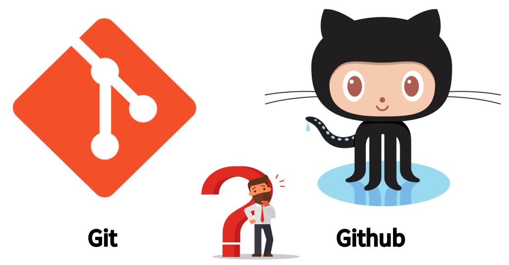

# Understanding Git and GitHub: Applications in Genomic Analysis

## What is Git?

Git is a distributed version control system designed to handle everything from small to very large projects with speed and efficiency. It allows multiple people to work on the same project simultaneously without overwriting each other's changes. Git tracks changes to files, supports branching and merging, and maintains a complete history of the project.

### Key Features of Git

- **Version Control**: Tracks changes to files and allows you to revert to previous versions.
- **Branching and Merging**: Enables the creation of branches for independent work and merging them back into the main project.
- **Distributed System**: Each user has a full copy of the repository, supporting offline work and decentralized collaboration.

## What is GitHub?

GitHub is a web-based platform that provides hosting for Git repositories. It offers collaboration features such as issue tracking, pull requests, and code reviews. GitHub enhances Git by providing a user-friendly interface and additional tools for managing repositories and collaborating with others.

### Key Features of GitHub

- **Remote Repository Hosting**: Stores Git repositories online, making them accessible from anywhere.
- **Pull Requests**: Allows you to propose changes, review code, and merge changes through a collaborative process.
- **Issue Tracking**: Provides a system to track bugs, feature requests, and other tasks related to the project.
- **Collaborative Tools**: Supports code reviews, discussions, and project management features to facilitate team collaboration.

## Differences Between Git and GitHub

| **Feature**              | **Git**                                              | **GitHub**                                                |
|--------------------------|------------------------------------------------------|------------------------------------------------------------|
| **Type**                 | Version control system                              | Online platform for hosting Git repositories              |
| **Function**             | Manages versions of files locally                   | Provides remote repository hosting and collaboration tools|
| **Installation**         | Installed locally on a computer                     | Web-based service, accessed through a browser             |
| **Collaboration**        | Primarily local, with commands to push/pull changes  | Facilitates team collaboration with pull requests and issues|
| **Repository Hosting**   | No hosting capabilities                              | Hosts repositories online for sharing and collaboration    |

## How Git and GitHub Benefit Genomic Analysis

In genomic analysis, Git and GitHub offer numerous advantages:

### 1. **Version Control for Analysis Scripts**

Genomic analyses often involve complex workflows and scripts. Git helps you track changes to these scripts over time, ensuring you can revert to previous versions if needed and maintain a history of your computational methods.

### 2. **Collaborative Research**

GitHub enables multiple researchers to collaborate on genomic projects by providing a platform to share and review code, datasets, and results. You can use GitHub's issue tracking to manage tasks and track progress.

### 3. **Reproducibility**

In genomics, reproducibility is crucial. By using Git and GitHub, you can ensure that your analysis pipelines and scripts are versioned and shared, making it easier for others to reproduce your results. This enhances the transparency and reliability of your research.

### 4. **Integration with Computational Tools**

Git and GitHub integrate well with various computational tools and platforms used in genomics. For example:
- **Nextflow**: A workflow management system that can be version-controlled using Git.
- **Jupyter Notebooks**: Interactive notebooks used for data analysis that can be tracked with Git.

### 5. **Documentation and Sharing**

GitHub provides features for documenting your project through README files and wikis. This helps in maintaining detailed documentation for your genomic analysis workflows, datasets, and methodologies, making it easier for others to understand and use your work.

## Practical Example

Consider a genomic research project involving a pipeline for analyzing sequencing data. By using Git and GitHub:
1. **Version Control**: Track changes to the pipeline scripts, ensuring you have a history of modifications and updates.
2. **Collaboration**: Team members can contribute to the pipeline, review each other’s code, and merge changes using pull requests.
3. **Reproducibility**: The entire analysis workflow is versioned and documented, allowing other researchers to replicate the analysis and validate results.

## Conclusion

Git and GitHub are powerful tools that enhance version control, collaboration, and reproducibility in genomic research. By integrating these tools into your workflow, you can manage complex analyses more effectively, collaborate with others, and ensure the reproducibility of your research.

For more information on Git and GitHub, check out their official documentation:
- [Git Documentation](https://git-scm.com/doc)
- [GitHub Documentation](https://docs.github.com/en)
